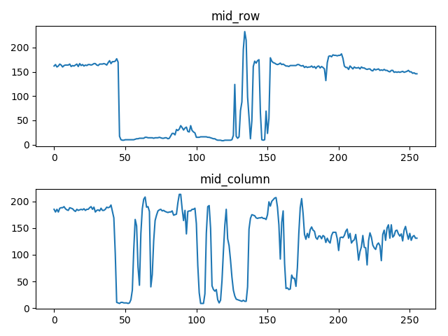
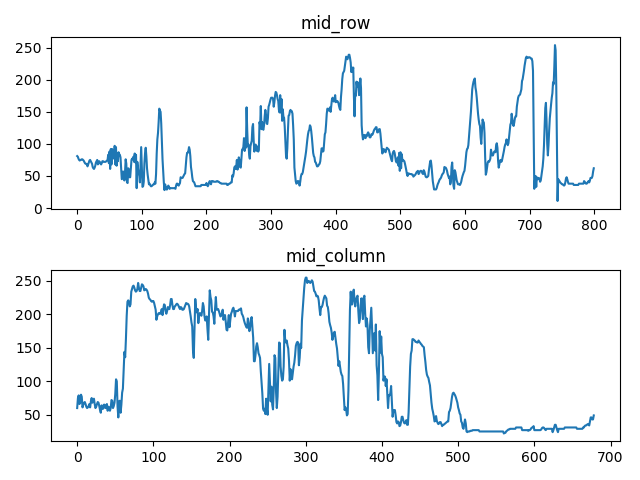
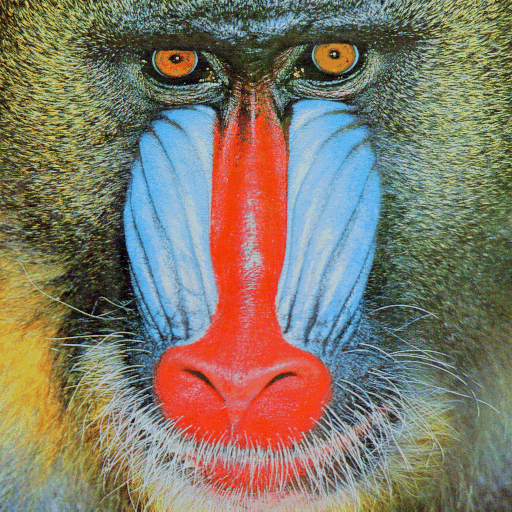
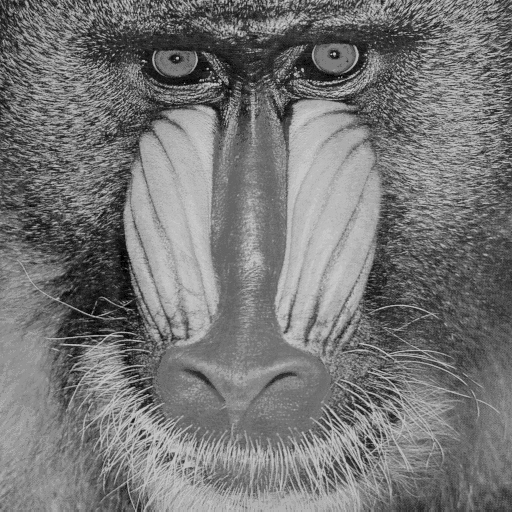

# Section 1: 灰度图像处理

> 实验环境
> * Python 3.6.0
> * Opencv 3.1.0

## 问题1 黑白图像灰度扫描

### 问题描述 & Code
实现一个函数s=scanLine4e(f, I, loc)，其中f是一个灰度图像，I是一个整数，loc是一个字符串。当loc为’row’时，I代表行数；当loc为’column’时，I代表列数。输出s是对应的相关行或列的像素矢量。

```Python
def scanLine4e(f, I, loc):
    """
    Parameters:
        f: Grayscale image
        I: An int num
        loc: 'row' or 'column'
    Return:
        A list of pixel value of the specific row/column
    """
    if loc == 'row':
        return f[I, :]
    elif loc == 'column':
        return f[:, I]
    else:
        raise ValueError("The third parameter should be row/column")
```

调用上述函数，提取cameraman.tif和einstein.tif的中心行和中心列的像素矢量并将扫描结果绘制成图。
> 注：对于行/列总像素数为偶数的情况，取中间两行/列中较后一个

```Python
import cv2
import matplotlib.pyplot as plt

from scanLine4e import scanLine4e

def main(filename):
    """
    Main function
    """
    # Read image
    print ("Processing {} ...".format(filename))
    img = cv2.imread(filename, cv2.IMREAD_GRAYSCALE)

    # Call function :scanLine4e 
    mid_row = scanLine4e(img, img.shape[0]//2, 'row')
    mid_col = scanLine4e(img, img.shape[1]//2, 'column')

    # Plot
    fig = plt.figure()
    row = fig.add_subplot(2,1,1)
    column = fig.add_subplot(2,1,2)

    row.set_title("mid_row")
    column.set_title("mid_column")

    row.plot(mid_row)
    column.plot(mid_col)

    plt.tight_layout()
    plt.savefig("{}_result.png".format(filename[:-4]))

if __name__ == "__main__":
    main("cameraman.tif")
    main("einstein.tif")
```

### 实验 & 结果
运行[main.py](./problem_1/main.py)以复现结果
<div align=center>
    
    
    
    
</div>

## 问题2 彩色图像转换为黑白图像

### 问题描述 & Code
图像处理中的一个常见问题是将彩色RGB图像转换成单色灰度图像。第一种常用的方法是取三个元素R、G、B的均值。第二种常用的方式，又称NTSC标准，考虑了人类的彩色感知体验，对于R、G、B三通道分别采用了不同的加权系数，分别是R通道0.2989，G通道0.5870，B通道0.1140.实现一个函数g=rgblgray(f,method)，其功能是将一幅24位RGB图像f转换成灰度图像g。当method的值为'average'时，采用第一种转换方式；当method值为'NTSC'时，采用第二种方法。（该函数将NTSC作为缺省方式）

```Python
import numpy as np

def rgblgray(f, method='NTSC'):
    """
    Parameters:
        f: image(RGB)
        method: 'average' or 'NTSC'
    Return:
        image in grayscale
    """
    if method == 'average':
        img_gray = f[:,:,0]/3 + f[:,:,1]/3 + f[:,:,2]/3
    elif method == 'NTSC':
        img_gray = f[:,:,0]*0.2989+f[:,:,1]*0.5870+f[:,:,2]*0.1140
    else:
        raise ValueError("The 3rd parameter should be average/NTSC")
    
    img_gray = img_gray.astype(np.uint8)
    return img_gray
```

调用上述函数，将图像mandril_color.tif和lena512color.tiff用上诉两种方式转换为单色灰度图像。

```Python
import cv2 

from rgblgray import rgblgray

def main(filename):
    """
    Main function
    """
    # Read image
    print ("Processing {} ...".format(filename))
    img = cv2.imread(filename)

    # BGR 2 RGB
    img = cv2.cvtColor(img, cv2.COLOR_BGR2RGB)  # BGR 2 RGB

    # Call function: rgblgray
    img_gray_a = rgblgray(img, 'average')
    img_gray_NTSC = rgblgray(img, 'NTSC')
    
    # Save image
    cv2.imwrite("{}_average.png".format(filename[:-4]), img_gray_a)
    cv2.imwrite("{}_NTSC.png".format(filename[:-4]), img_gray_NTSC)

if __name__ == "__main__":

    main("lena512color.tiff")
    main("mandril_color.tif")
```
### 实验结果 & 讨论
运行[main.py](./problem_2/main.py)以复现结果

<div align=center>
    
    
    
    
    
    
</div>

从实验结果图中可以看出，由于NTSC标准考虑了人类的彩色感知体验，以该方式加权平均RGB三通道所得的灰度图片更好地保留了彩色图片中的细节纹理特征，相较直接平均的第一种方式，其效果更优。