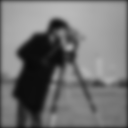
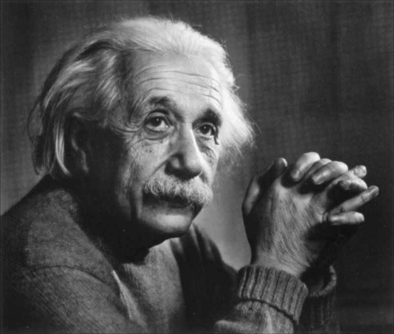
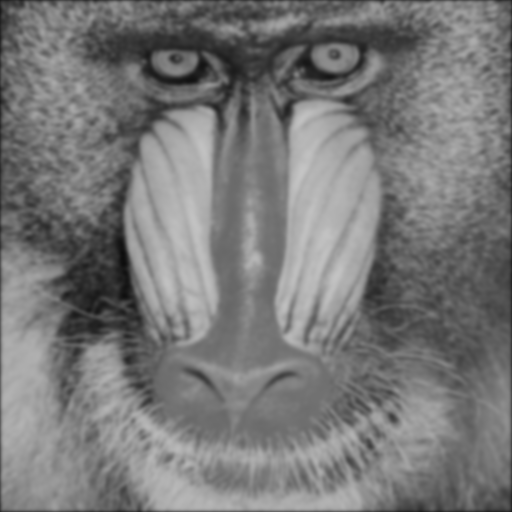
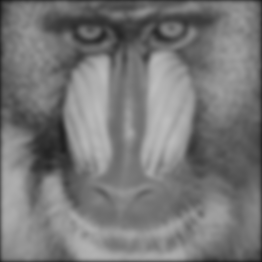
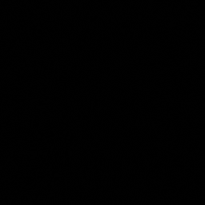
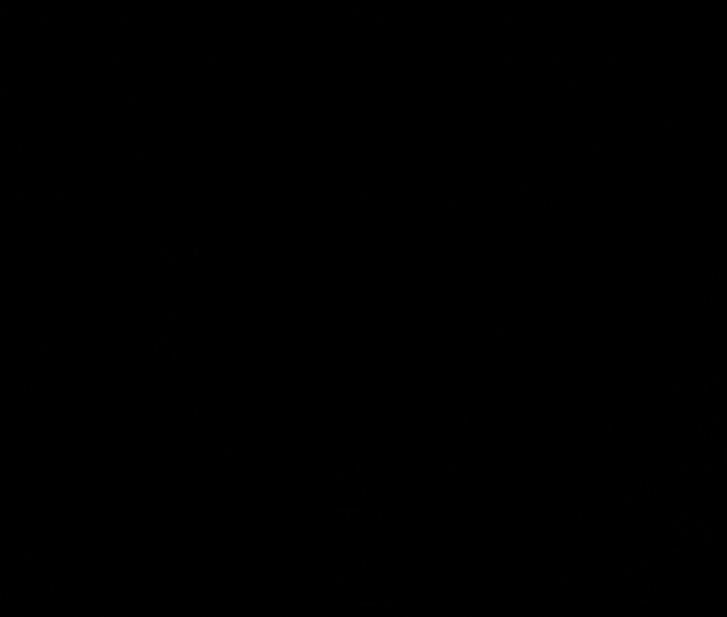
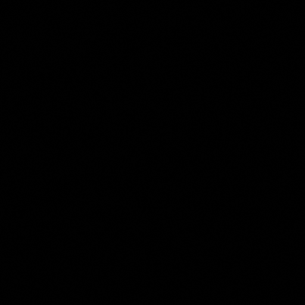
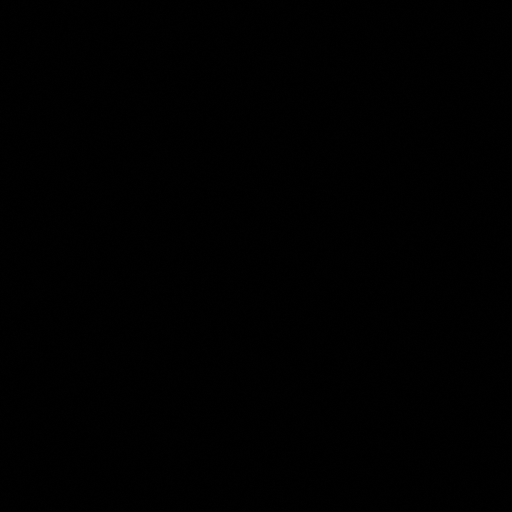
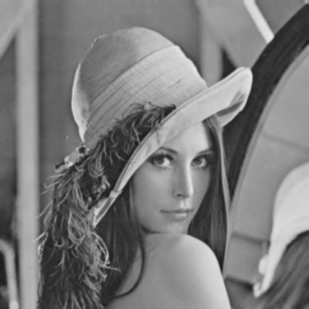

# Section 2: 二维卷积与滤波

> 实验环境
> * Python 3.6.0
> * Opencv 3.1.0

## 问题1 图像二维卷积函数

### 问题描述
实现一个函数 g = twodConv(f, w), 其中 f 是一个灰度源图像,w 是一个矩形卷积核。要求输出图像 g 与源图像 f 大小(也就是像素的行数和列数)一致。请意,为满足这一要求,对于源图像 f 需要进行边界像素填补(padding)。这里请实现两种方案。第一种方案是像素复制,对应的选项定义为’replicate’,填补的像素拷贝与其最近的图像边界像素灰度。第二种方案是补零,对应的选项定义为’zero’, 填补的像素灰度为 0. 将第二种方案设置为缺省选择。

### Code实现
实现时按照以下步骤：
* 统计输入图片信息和核信息
* Padding：

    首先新建一Padding后相应大小的零矩阵，将图片元素填至对应位置，实现“补0”的Padding方式；若Padding方式为“replicate”则一次将首行末行和首列末列元素复制并填充至相应位置。
* 卷积：
  * 卷积核旋转180°
  * 遍历元素，对应相乘并求和，最终得到卷积结果
```Python
import cv2
import numpy as np 

def twodConv(f, k, p='zero'):
    """
    2D Conv
    Parameters:
        f: the input image (Gray Scale)
        k: conv kernel
        p: padding mode, e.g. 'replicate' or 'zero'
    Return:
        the conv result with the same shape as the input
    """
    # Shape of image & kernel
    h_f, w_f = f.shape
    h_k, w_k = k.shape

    r_h = (h_k-1)//2
    r_w = (w_k-1)//2

    # Padding
    f_pad = np.zeros([h_f+2*r_h, w_f+2*r_w])
    f_pad[r_h:h_f+r_h, r_w:w_f+r_w] = f

    if p == 'replicate':
        for i in range(r_h):
            f_pad[i, :] = f_pad[r_h, :]
            f_pad[-1-i, :] = f_pad[h_f-r_h+1, :]
        for i in range(r_w):
            f_pad[:, i] = f_pad[:, r_w]
            f_pad[:, -1-i] = f_pad[:, w_f-r_w+1]
    elif p == 'zero': pass
    else:
        raise ValueError("The third one should be replicate or zero")

    # Conv
    f_res = np.zeros_like(f)
    k = np.rot90(k, 2)

    for i in range(r_h, h_f+r_h):
        for j in range(r_w, w_f+r_w):
            roi = f_pad[i-r_h:i+r_h+1, j-r_w:j+r_w+1]
            f_res[i-r_h][j-r_w] = np.sum(roi*k)
    
    return f_res.astype(np.uint8)
```

## 问题2 归一化二维高斯滤波核函数
### 问题描述
实现一个高斯滤波核函数 w = gaussKernel(sig,m),其中 sig 对应于高斯函数定义中的σ,w的大小为 m×m。请注意,这里如果 m 没有提供,需要进行计算确定。如果 m 已提供但过小,应给出警告信息提示。w 要求归一化,即全部元素加起来和为 1.

### Code实现
实现时，首先根据输入的sig值计算高斯核的最小尺寸M。若输入了m，且满足不小于最小尺寸的条件，则继续，若不满足，则Raise一个参数错误；若未输入m，则使用M作为高斯核尺寸。然后，计算并依次生成高斯核每个位置的数值。最后，进行归一化操作。

```Python
import cv2
import numpy as np
import math

def gaussKernel(sig, m=None):
    """
    Generate a Gauss kernel.
    Parameters:
        sig: sigma
        m: the shape of the Gauss kernel is m*m
    Return:
        a Gauss kernel
    """
    # Cal & Judge m
    M = math.ceil(sig*3)*2 + 1
    if m:
        if m < M: 
            raise ValueError("m is smaller than it should be.")
        else: pass
    else:
        m = M
    
    # Generate kernel
    k = np.zeros((m,m))
    center = m//2
    s = sig**2

    for i in range(m):
        for j in range(m):
            x, y = i-center, j-center
            k[i][j] = (1/(2*math.pi*s))*math.exp(-(x**2+y**2)/(2*s))

    k = k/np.sum(k)

    return k
```

## 问题3 灰度图像的高斯滤波
### 问题描述
调用上面实现的函数,对于作业 1 中产生的灰度图像(cameraman, einstein, 以及 lena512color和 mandril_color 对应的 NTSC 转换后的灰度图像)进行高斯滤波,采用σ=1,2,3,5。任选一种像素填补方案。

对于σ=1 下的结果,与直接调用相关函数的结果进行比较(可以简单计算差值图像)。然后,任选两幅图像,比较其他参数条件不变的情况下像素复制和补零下滤波结果在边界上的差别。
### Code实现
依次对4幅图片展开实验，分别在sig为1,2,3,5的情况下进行高斯滤波(Padding方式采用默认的’zero‘)，并当sig=1时与Opencv自带的高斯滤波的结果进行减法操作，以对比效果。

另外，对lena.png和mandril.png进行Padding方式为replicate的高斯滤波。
```Python
import cv2
import numpy as np 

from twodConv import twodConv
from gaussKernel import gaussKernel

def main(filename):
    """
    Main function for problem 3
    """
    # Read image
    print ("Processing {} ...".format(filename))
    img = cv2.imread(filename, cv2.IMREAD_GRAYSCALE)

    # Generate kernel & Conv
    sig_list = [1,2,3,5]

    for sig in sig_list:
        # Generate Gauss kernel
        k = gaussKernel(sig)

        #Conv2D
        res = twodConv(img, k)
        cv2.imwrite("{}_{}.png".format(filename[:-4],sig), res)

        # Compare with opencv
        if sig == 1:
            res_cv2 = cv2.GaussianBlur(img, (7,7), 1, borderType=0)
            sub = res_cv2 - res
            cv2.imwrite("{}_sub.png".format(filename[:-4]), sub)
        
        # Padding mode: replicate VS zero
        rep_list = ['lena.png', 'mandril.png']
        if filename in rep_list:
            res_rep = twodConv(img, k, 'replicate')
            cv2.imwrite("{}_rep_{}.png"\
                        .format(filename[:-4],sig), res_rep)

if __name__ == "__main__":
    img_list = ['cameraman.png', 'einstein.png', 'lena.png', \
                'mandril.png']
    for i in img_list:
        main(i)
```
### 实验结果与分析
* 不同sigma下的滤波效果对比

<div align=center>
    
    
    
    
    
</div>
<div align=center>
    
    
    
    
    
</div>
<div align=center>
    
    
    
    
    
</div>
<div align=center>
    
    
    
    
    
</div>

上图中左侧第一列为原始图片，其右侧均为高斯滤波后的结果，由左至右Sigma的数值依次增大，分别为1、 2 、3 、5.可以清晰地看出，随着Sigma的增大，图像模糊程度递增，显示出的尺度逐渐变大。

* 与直接调用函数的效果对比(Sigma=1)

<div align=center>
    
    
    
    
</div>

通过与直接调用函数的结果求差值图像，可以发现，二者差异相当小，差值图像几乎全黑。为进一步细致对比，输出差值矩阵，观察发现差值最大为1.

* 不同Padding方式在边界上的差别对比

<div align=center>
    
    
    
    
</div>
<div align=center>
    
    
    
    
</div>

<div align=center>
    
    
    
    
</div>
<div align=center>
    
    
    
    
</div>

本部分使用lena和mandril两个图在不同padding方法下的效果进行对比分析。第1 、3行为补零方式，第2、 4行为像素复制方式；由左至右高斯滤波的Sigma值递增，为1 、2 、3和5.可以看到，相比像素复制方式，补零方式的结果图的图像边界上存在黑边，且随着Sigma的增大，黑边变宽。理论上分析，这是因为采用补零方式进行Padding时，边界周围元素均填充0，在卷积时会直接影响边界元素的数值，拉低边界元素的整体数值，从而体现为黑边。同时，随着卷积核尺寸的增加，受填充像素影响的边界元素数量增加，进而体现为黑边变宽。