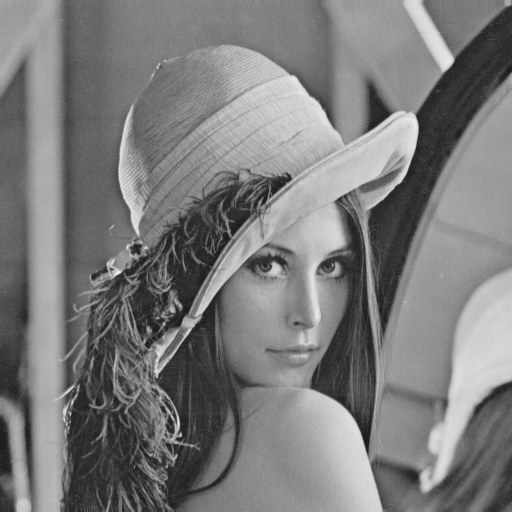

# Section 4: 图像增强

> 实验环境
> * Python 3.6.0
> * Opencv 3.1.0

## 问题1 直方图均衡化

### 问题描述
编写一个图像直方图均衡化程序: g=histequal4e(I)，其中I是8比特图像.

### Code实现
实现思路如下:
* 获取原图像的灰度直方图
* 根据各灰度所占比重重构均衡化的灰度直方图
* 根据上一步结果,生成直方图均衡化的图片

运行方式: `python pb1.py`
```Python
import cv2
import numpy as np 

def histequal4e(img):
    """
    直方图均衡化
    Parameters:
        img : 原图片(GRAY)
    Return:
        直方图均衡化后的图片
    """
    # 获取原图像灰度直方图
    hist = np.bincount(img.flatten(), minlength=256)
    # 根据比重构建均衡化后的直方图
    hist_new = np.cumsum(hist)/np.sum(hist) * 255
    # 生成直方图均衡化的图片
    img_result = np.zeros_like(img)
    for i in range(img.shape[0]):
        for j in range(img.shape[1]):
            img_result[i,j] = hist_new[img[i,j]]
    return img_result

if __name__ == "__main__":
    img = cv2.imread("luna.png", 0)
    img_result = histequal4e(img)
    cv2.imwrite("pb1_result.png", img_result)
```

### 实验结果与分析
实验结果如下图所示, 左图为原图, 右图为直方图均衡化后的图像. 可以明显看出, 经过直方图的均衡化, 图片的灰度分布更均匀, 直接表现为图片的对比度更高, 显得更为清晰.
<div align=center>
    
    
</div>

## 问题2 保边缘平滑法的实现

### 问题描述
编写一个程序完成如下功能：读入清晰图像，加上椒盐噪声，采用有选择保边缘平滑法对图像进行平滑。

### Code实现
实现思路如下:
* 实现函数sp_noise(img),向图像添加椒盐噪声.
* 实现函数smooth(img), 用选择保边缘平滑法对噪声图片进行平滑操作, 其具体思路为:对每个像素进行操作, 分别利用九种不同模板, 计算各模板内像素的平均值和方差, 将最小方差模板对应的像素平均值赋值给该像素. 值得注意的是, 对于图像边缘处的像素可能并不是每个模板均存在.
* 依次对图片应用上述两个函数, 实现对图片施加椒盐噪声, 再利用选择保边缘平滑法对噪声图片进行平滑.

运行方式: `python pb2.py`
```Python
import cv2
import numpy as np

def sp_noise(img):
    """
    给图像添加椒盐噪声
    Parameters:
        img: 原图
    Return:
        添加椒盐噪声后的图片
    """
    import random


    img_noise = np.zeros_like(img)
    for i in range(img.shape[0]):
        for j in range(img.shape[1]):
            rdn = random.random()
            # 椒噪声
            if rdn < 0.05:
                img_noise[i][j] = 0
            # 盐噪声
            elif rdn > 0.95:
                img_noise[i][j] = 255
            # 不添加噪声
            else:
                img_noise[i][j] = img[i][j]

    return img_noise

def smooth(img):
    """
    用选择保边缘平滑法
    Parameters:
        img: 待平滑图像(GRAY)
    Return:
        平滑后图像
    """
    img_smooth = np.zeros_like(img)
    h, w = img.shape[0:2]
    for i in range(h):
        for j in range(w):
            std_mean = []
            # 3邻域
            if i>0 and j>0 and i<h-1 and j<w-1:
                mask = img[i-1:i+2, j-1:j+2].flatten().tolist()
                std_mean.append((np.std(mask),np.mean(mask)))
            
            # 上五边形
            if i>1 and j>0 and j<w-1:
                mask = img[i-2:i, j-1:j+2].flatten().tolist()
                mask.append(img[i,j])
                std_mean.append((np.std(mask),np.mean(mask)))
            # 下五边形
            if j>0 and i<h-2 and j<w-1:
                mask = img[i+1:i+3, j-1:j+2].flatten().tolist()
                mask.append(img[i,j])
                std_mean.append((np.std(mask),np.mean(mask)))
            # 左五边形
            if i>0 and j>1 and i<h-1:
                mask = img[i-1:i+2, j-2:j].flatten().tolist()
                mask.append(img[i,j])
                std_mean.append((np.std(mask),np.mean(mask)))
            # 右五边形
            if i>0 and i<h-1 and j<w-2:
                mask = img[i-1:i+2, j+1:j+3].flatten().tolist()
                mask.append(img[i,j])
                std_mean.append((np.std(mask),np.mean(mask)))
            

            # 左上六边形
            if i>1 and j>1:
                mask = [img[i-2,j-2], img[i-2,j-1], img[i-1,j-2], 
                    img[i-1,j-1], img[i-1,j], img[i,j-1], img[i,j]]
                std_mean.append((np.std(mask),np.mean(mask)))
            # 右上六边形
            if i>1 and j<w-2:
                mask = [img[i-2,j+2], img[i-2,j+1], img[i-1,j+2], 
                    img[i-1,j+1], img[i-1,j], img[i,j+1], img[i,j]]
                std_mean.append((np.std(mask),np.mean(mask)))
            # 右下六边形
            if i<h-2 and j<w-2:
                mask = [img[i+2,j+2], img[i+2,j+1], img[i+1,j+2], 
                    img[i+1,j+1], img[i+1,j], img[i,j+1], img[i,j]]
                std_mean.append((np.std(mask),np.mean(mask)))
            # 左下六边形
            if i<h-2 and j>1:
                mask = [img[i+2,j-2], img[i+2,j-1], img[i+1,j-2], 
                    img[i+1,j-1], img[i+1,j], img[i,j-1], img[i,j]]
                std_mean.append((np.std(mask),np.mean(mask)))
            # 选取方差做小的模板的均值作为改点像素值
            img_smooth[i,j] = sorted(std_mean, 
                            key=lambda std_mean:std_mean[0])[0][1]
    return img_smooth

if __name__ == "__main__":
    img = cv2.imread("luna.png", 0)
    # 添加椒盐噪声
    img_noise = sp_noise(img)
    cv2.imwrite("pb2_noise.png", img_noise)
    # 平滑:选择保边缘平滑法
    from time import time
    start = time()
    img_smooth = smooth(img_noise)
    end = time()
    print ("time cost:", end-start)
    cv2.imwrite("pb2_result.png", img_smooth)
```

### 实验结果与分析
实验结果如下图所示, 左图为施加椒盐噪声后的图像, 右图为经选择保边缘平滑法处理后的图像. 观察图片可以发现, 选择保边缘平滑法能一定程度上有效消除噪声, 且保持图片区域边界的细节不被破坏. 但由于需要对每个像素做九个模板操作,并进行数值比较, 因此算法耗时较长.
<div align=center>
    
    
</div>

# 问题 3 拉普拉斯增强
## 问题描述
编写一个程序完成拉普拉斯增强.

## Code实现
实现思路如下:
* 生成拉普拉斯增强算子核
* 利用上一步生成的增强算子对原图片进行滤波, 实现对原图片的拉普拉斯增强

运行方式: `python pb3.py`
```Python
import cv2
import numpy as np

def Lap_eh(img):
    """
    拉普拉斯增强
    Parameters:
        img: 待增强图像
    Return:
        增强后的图像
    """
    lap_kernel = np.array([[0, -1, 0], [-1, 5, -1], [0, -1, 0]])
    img_eh = cv2.filter2D(img, -1, lap_kernel)
    return img_eh

if __name__ == "__main__":
    img = cv2.imread("luna.png", 0)
    img_eh = Lap_eh(img)
    cv2.imwrite("pb3_result.png", img_eh)
```

### 实验结果与分析
实验结果如下图所示, 左图为原始图像, 右图为经拉普拉斯增强后的图像. 对比增强前后图片可以发现, 经拉普拉斯增强后, 图片中的边缘更加清晰, 图片细节的纹理更加明显, 整体的视觉效果更强.
<div align=center>
    
    
</div>