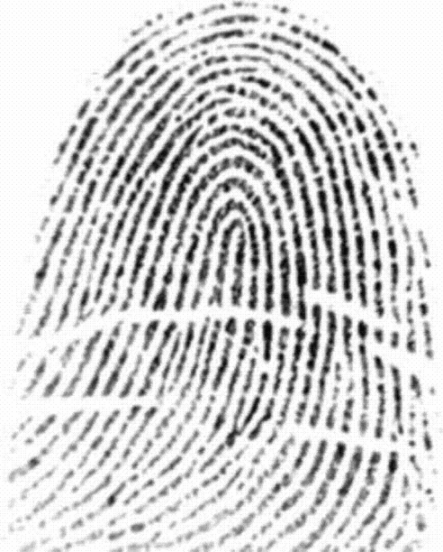
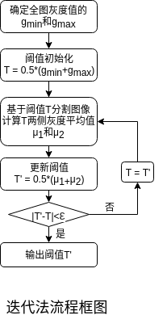
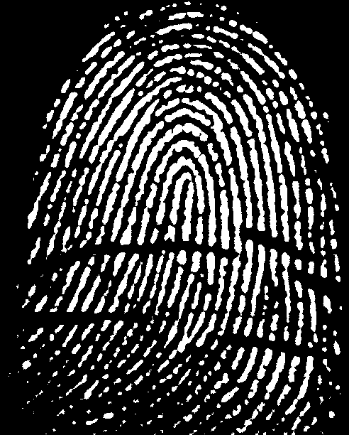
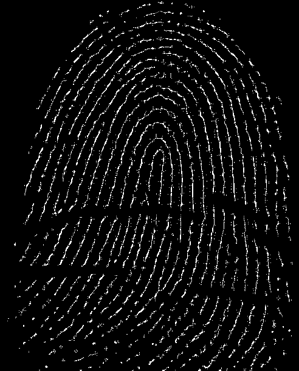
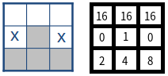
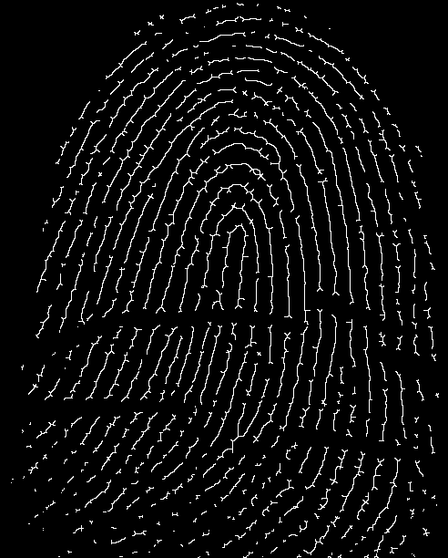
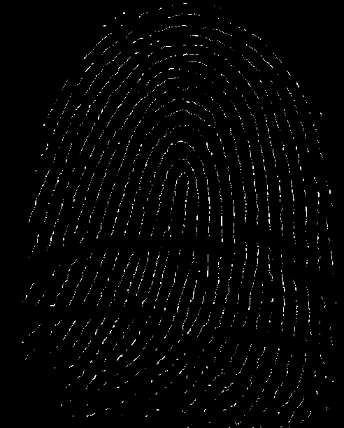
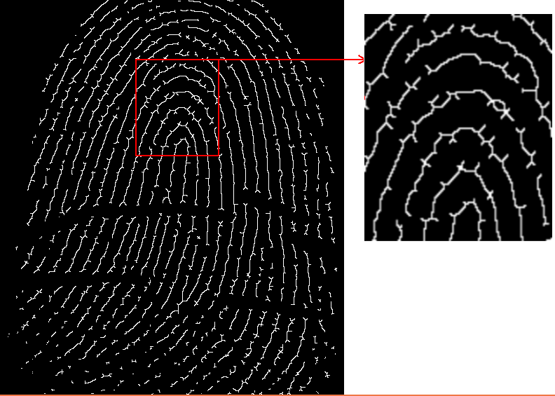
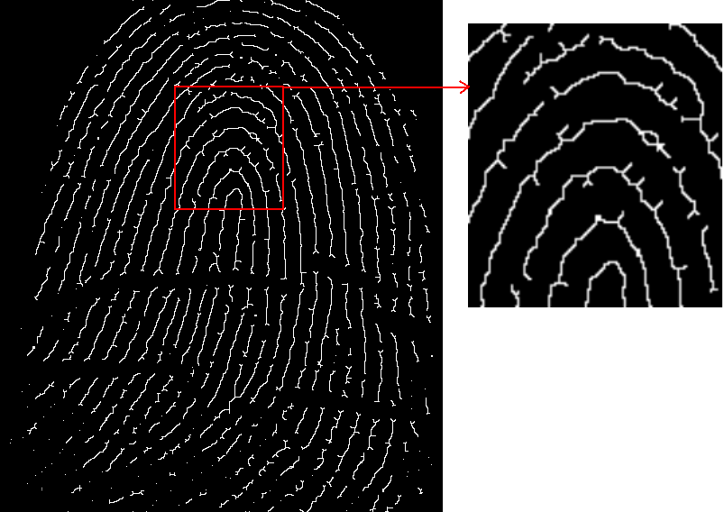

# Section 5: 图像形态学处理--以指纹图像处理为例

> 实验环境
> * Python 3.6.0
> * Opencv 3.1.0

## 1. 问题描述
编一个程序实现如下功能：
* 读入一幅指纹图像（自己找）
* 对图像进行二值化（方法自定，可以是阈值法）
* 采用形态学骨架提取和距离变换骨架提取两种算法分别提取图像骨架
* 采用裁剪算法，并分析其效果

## 2. Code实现 & 实验
### 2.1 整体实现思路与分析
首先, 为实现上述要求功能, 需实现以下子功能:
* 灰度图像二值化
* 形态学基础算法: 腐蚀, 膨胀, 开运算
* 骨架提取算法: 为了更好地理解理论知识, 这里采用三种方法提取骨架(基于腐蚀和开运算的骨架提取, 基于细化的骨架提取, 基于距离变换的骨架提取)
* 裁剪算法

下面,依次展开. 实验结果通过运行`python main.py`可获得.

### 2.2 灰度图像二值化: 迭代法阈值确定(binaryzation.py)
<div align=center>
    
</div>
本次作业以上图为实验所用的指纹图像. 可以看到, 此图像较为模糊, 某些区域较难区分前景和背景, 很难人为地确定二值化阈值. 因此, 基于迭代算法确定阈值, 然后进行二值化. 迭代算法的框图如下图所示. 
<div align=center>
    
</div>

```Python
def loop(img):
    """
    根据阈值分割的迭代法计算阈值T
    Parameters:
        img: origin image (GRAY)
    Return:
        Threshold T
    """
    g_min = int(np.min(img))
    g_max = int(np.max(img))
    T = 0
    T_new = 0.5*(g_min + g_max)

    eps = 1e-5

    while np.abs(T_new - T) >= eps:
        T = T_new
        l = []
        g = []
        for i in range(img.shape[0]):
            for j in range(img.shape[1]):
                if img[i,j] < T: l.append(img[i,j])
                else: g.append(img[i,j])
        T_new = 0.5*(np.mean(l) + np.mean(g))
    
    return T_new

def binaryzation(img):
    """
    灰度图像二值化
    Parameter:
        img: 灰度图像
    Return:
        二值化图像
    """
    # 迭代法求阈值
    k = loop(img)
    # 二值化
    img_bin = np.where(img>k, 0, 255)
    
    return k, img_bin.astype(np.uint8)
```
通过迭代法得到二值化阈值174.78, 二值化的结果如下图所示. 左图为原图, 右图为二值化结果.可以看到, 二值化效果较优.
<div align=center>
    
    
</div>

### 2.3 形态学基础算法(basic_function.py)
主要实现了本作业所需的三个基础算法: 腐蚀, 膨胀 和 开运算.
> 为了提高运算效率, 在实现腐蚀和膨胀时, 均基于位移运算.
* 基于位移运算的腐蚀运算
```Python
def erode(img):
    """
    使用3*3矩形结构子 腐蚀操作
    Parameter:
        img: 待腐蚀图像
    Return:
        img_result: 腐蚀结果图像
    """
    # 初始化图像平移矩阵
    m_1 = np.array([[1,0,-1],[0,1,-1]], dtype=np.float32)
    m_2 = np.array([[1,0,0],[0,1,-1]], dtype=np.float32)
    m_3 = np.array([[1,0,1],[0,1,-1]], dtype=np.float32)
    m_4 = np.array([[1,0,-1],[0,1,0]], dtype=np.float32)
    m_5 = np.array([[1,0,1],[0,1,0]], dtype=np.float32)
    m_6 = np.array([[1,0,-1],[0,1,1]], dtype=np.float32)
    m_7 = np.array([[1,0,0],[0,1,1]], dtype=np.float32)
    m_8 = np.array([[1,0,1],[0,1,1]], dtype=np.float32)
    M = [m_1, m_2, m_3, m_4, m_5, m_6, m_7, m_8]

    # 9个平移后的图像取交集得到腐蚀结果
    img_result = img.copy()
    for i in M:
        img_shift = cv2.warpAffine(img,i,(img.shape[1],img.shape[0]))
        img_result = cv2.bitwise_and(img_result, img_shift)
    
    return img_result
```
* 基于位移运算的膨胀运算
```Python

def dilate(img):
    """
    使用3*3矩形结构子 膨胀操作
    Parameter:
        img: 待膨胀图像
    Return:
        img_result: 膨胀结果图像
    """
    # 初始化图像平移矩阵
    m_1 = np.array([[1,0,-1],[0,1,-1]], dtype=np.float32)
    m_2 = np.array([[1,0,0],[0,1,-1]], dtype=np.float32)
    m_3 = np.array([[1,0,1],[0,1,-1]], dtype=np.float32)
    m_4 = np.array([[1,0,-1],[0,1,0]], dtype=np.float32)
    m_5 = np.array([[1,0,1],[0,1,0]], dtype=np.float32)
    m_6 = np.array([[1,0,-1],[0,1,1]], dtype=np.float32)
    m_7 = np.array([[1,0,0],[0,1,1]], dtype=np.float32)
    m_8 = np.array([[1,0,1],[0,1,1]], dtype=np.float32)
    M = [m_1, m_2, m_3, m_4, m_5, m_6, m_7, m_8]

    # 9个平移后的图像取并集得到腐蚀结果
    img_result = img.copy()
    for i in M:
        img_shift = cv2.warpAffine(img,i,(img.shape[1],img.shape[0]))
        img_result = cv2.bitwise_or(img_result, img_shift)
    
    return img_result
```
* 开运算
```Python
def open_morph(img):
    """
    开运算
    Parameter:
        img: 待进行开运算的图像
    Return:
        img_result: 开运算结果图像
    """
    # 先腐蚀, 再膨胀
    img_result = erode(img)
    img_result = dilate(img_result)

    return img_result
```

### 2.4 基于腐蚀和开运算的骨架提取(sk_morph.py)
首先实现根据骨架定义的提取方式, 也即基于腐蚀和开运算的骨架提取.
```Python
def sk_morph(img):
    """
    形态学骨架提取
    Parameter:
        img: 待提取骨架图像(默认为前景为白色的二值图像)
    Return:

        img_result: 骨架图像(前景为白色的二值图像)
    """
    # 骨架图像初始化
    img_result = np.zeros_like(img)

    # 循环提取骨架, 当腐蚀后图像无前景时停止
    while(np.sum(img)):
        # 开运算
        img_open = open_morph(img)
        # 求差
        img_s = img - img_open
        # 求并生成骨架
        img_result = cv2.bitwise_or(img_result, img_s.copy())      
        # 腐蚀
        img = erode(img)
    return img_result
```
对二值化图像利用上述算法提取骨架, 结果如下图所示. 左图为二值化结果, 右图为提取结果.
<div align=center>
    
    
</div>


### 2.5 基于细化的骨架提取(sk_thin.py)
细化也可以达到骨架提取的目的, 选用细化常用的结构元序列进行细化操作.

> **值得注意的是**,实现时为提升效率, 细化时采用卷积的方式实现, 而未使用循环语句. 由于细化时需对每个结构元进行击中击不中运算, 而击中击不中运算中包含判断. 为在根据卷积结果判断击中击不中, 对结果元中的每个位置进行差异化赋值. 赋值方法如下:
> * 对于结构元中的击中位置, 以$2^n$赋值, 其中n为击中位置的序号(从0开始). 对于细化常用的结构元, 有四个击中区域, 则$n=0,1,2,3$, 也即分别赋值1,2,4,8.
> * 对于结构元中的击不中位置, 均赋值$2^(n+1)$.对于细化常用的结构元, 有四个击不中区域, 则$n+1=4$, 也即均赋值16.
> * 对于结构元中的不必考虑位置, 赋值为0.
> 
> 此时, 若击中, 则卷积结果为15, 否则为击不中. 因此, 卷积后只需找到结果中等于15的位置即为击中位置,其余位置为击不中.
<div align=center>
    
</div>

```Python
def thinning(img, K):
    """
    细化运算实体
    Parameters:
        img: 待细化图像
        K: 结构子序列
    Return:
        细化后结果图像
    """
    # 归一
    img_result = img/255
    # 初始化用于保存上一次结果的矩阵
    img_old = 1 - img_result

    # 循环细化.直至图像保持不变
    while np.sum(img_result-img_old):
        img_old = img_result
        for i in K:
            # 基于卷积结果的击中击不中
            img_temp = np.where(cv2.filter2D(img_result.copy(),-1,i
                        ,borderType=0)==15, 1, 0)            
            img_result = img_result - img_temp
   
    img_result *= 255
    return img_result.astype(np.uint8)

def sk_thin(img):
    """
    细化提取骨架
    Parameter:
        img: 待提取图像
    Return:
        提取骨架结果图像 
    """
    # 生成8个结构子序列
    k_1 = np.array([[16,16,16],[0,1,0],[2,4,8]], dtype=np.uint8)
    k_2 = np.array([[0,16,16],[1,2,16],[4,8,0]], dtype=np.uint8)
    k_3 = np.array([[1,0,16],[2,4,16],[8,0,16]], dtype=np.uint8)
    k_4 = np.array([[1,2,0],[4,8,16],[0,16,16]], dtype=np.uint8)
    k_5 = np.array([[1,2,4],[0,8,0],[16,16,16]], dtype=np.uint8)
    k_6 = np.array([[0,1,2],[16,4,8],[16,16,0]], dtype=np.uint8)
    k_7 = np.array([[16,0,1],[16,2,4],[16,0,8]], dtype=np.uint8)
    k_8 = np.array([[16,16,0],[16,1,2],[0,4,8]], dtype=np.uint8)

    K = [k_1, k_2, k_3, k_4, k_5, k_6, k_7, k_8]
    
    # 细化操作
    img_result = thinning(img, K)

    return img_result
```
对二值化图像利用上述算法提取骨架, 结果如下图所示. 左图为二值化结果, 右图为提取结果.
<div align=center>
    
    
</div>

### 2.6 基于距离变换的骨架提取(sk_distTrans.py)
基于距离变换的骨架提取首先通过形态学运算获得前景边界, 然后对边界图像做距离变换(彭老师提供了距离变换的Matlab代码, 由于本作业使用python-openCV, 因此距离变换直接调用函数, 距离为欧氏距离), 接着求距离变化中的局部极大值, 落入原二值图像中的局部极大值即为图像的骨架.

> **值得注意的是**,实现时为提升效率, 求取极大值时使用卷积方法实现, 构建8个卷积模板, 其作用为用中心元素像素值依次减去周围8个元素的像素值, 若某一位置得到的8个卷积结果均大于等于0, 则证明它是8邻域内的极大值.

```Python
def find_max(img):
    """
    获得8邻域内极大值像素组成的图像
    Parameter:
        img: 待操作图像(距离变换结果)
    Return:
        img_result: 由8邻域内极大值像素组成的二值化图像
    """
    # 生成8个减法模板
    kmax_1 = np.array([[-1,0,0],[0,1,0],[0,0,0]],dtype=np.float32)
    kmax_2 = np.array([[0,-1,0],[0,1,0],[0,0,0]],dtype=np.float32)
    kmax_3 = np.array([[0,0,-1],[0,1,0],[0,0,0]],dtype=np.float32)
    kmax_4 = np.array([[0,0,0],[-1,1,0],[0,0,0]],dtype=np.float32)
    kmax_5 = np.array([[0,0,0],[0,1,-1],[0,0,0]],dtype=np.float32)
    kmax_6 = np.array([[0,0,0],[0,1,0],[-1,0,0]],dtype=np.float32)
    kmax_7 = np.array([[0,0,0],[0,1,0],[0,-1,0]],dtype=np.float32)
    kmax_8 = np.array([[0,0,0],[0,1,0],[0,0,-1]],dtype=np.float32)
    kernel = [kmax_1, kmax_2, kmax_3, kmax_4, kmax_5, kmax_6,
              kmax_7, kmax_8]
    
    # 依次进行减法模板操作, 取结果交集为极大值像素图像
    img_result = cv2.bitwise_not(np.zeros_like(img, dtype=np.uint8))
    for i in kernel:
        # 减法模板滤波
        img_m = cv2.filter2D(img, -1, i)
        # 差值非负处取为255: 操作点像素值>=被减处像素
        img_m = np.where(img_m>=0.0, 255, 0)
        img_m = img_m.astype(np.uint8)
        # 大于等于8邻域内所有像素的点为区域极大值点
        img_result = cv2.bitwise_and(img_result, img_m)
    
    return img_result

def sk_distTrans(img):
    """
    基于距离变换的骨架提取
    Parameter:
        img: 待提取骨架图像(默认为前景为白色的二值图像)
    Return:
        img_result: 骨架图像(前景为白色的二值图像)
    """
    # 通过形态学操作获得前景边界
    img_bd = img - erode(img)
    # cv2.imwrite("bd.png", img_bd)
    # 对边界图像做距离变换
    img_distTrans = cv2.distanceTransform(
                            cv2.bitwise_not(img_bd.copy()),
                             cv2.DIST_L2, cv2.DIST_MASK_3)
    # 求距离变换图中的局部极大值
    img_max = find_max(img_distTrans)
    # 落入原二值图像中的局部极大值即为图像的骨架
    img_result = cv2.bitwise_and(img_max, img)

    return img_result
```
对二值化图像利用上述算法提取骨架, 结果如下图所示. 左图为二值化结果, 右图为提取结果. 和之前提取的骨架结果对比, 可以发现原二值图像中的某些细小的前景经过基于距离变换的骨架提取后消失(如图像左下方区域). 通过对算法实现过程进行分析, 我认为造成这种情况的原因如下: 细小点经形态学边界提取的结果通常为其本身, 而对边界图像求取距离变换后, 实心图像内部的距离均为0, 而外部距离大于0, 在并不符合区域内极大值点的要求, 因而造成细小点的消失.
<div align=center>
    
    
</div>

### 2.7 裁剪(tailor.py)
裁剪的目的是清除细化和骨架算法产生的一些不必要的附加成分. 为理解裁剪算法, 更清晰地感受裁剪的效果, 本部分以基于细化的骨架提取结果为例, 对其进行裁剪操作, 并对比分析其效果.

观察待裁剪图像, 可以发现图像主干周围存在寄生成分, 这里通过观察与实验, 假设3个及以下像素长度的分支均为寄生部分, 进行删除操作.实现步骤如下:
* 生成由8个常用于端点检测的结构元组成的结构元序列
* 利用上述序列连续对待裁剪图像细化3次
* 利用序列找到上一步结果图像的端点
* 对端点进行3次膨胀处理, 每次膨胀后用待裁剪图像做消减因子, 捡回"误伤"元素
* 取上一步结果和连续3次细化结果的并集图像为裁剪结果
  
> 这里涉及到击中击不中算法时仍使用前文所用的卷积方法

```Python
def thinning(img, K):
    """
    细化
    Parameters:
        img: 待细化图像
        K: 结构子序列
    Return:
        细化后结果图像
    """
    # 归一
    img_result = img/255
    # 利用结构子序列重复3次细化
    for i in range(3):
        for i in K:
            img_temp = np.where(cv2.filter2D(img_result.copy(),-1,i,
                                borderType=0)==3, 1, 0)
            img_result = img_result - img_temp
    
    img_result *= 255
    return img_result.astype(np.uint8)

def find_end(img, K):
    """
    找到端节点
    Parameters:
        img: 输入图像
        K: 结构子序列
    Return:
        只有端节点为前景的图像
    """
    # 像素归一化
    img_ones = img/255
    img_result = np.zeros_like(img, dtype=np.uint8)

    # 利用结构子序列寻找端点
    for i in K:
        img_temp = np.where(cv2.filter2D(img_ones.copy(),-1,i,
                            borderType=0)==3, 1, 0)
        img_result = img_result + img_temp
    
    img_result *= 255
    return img_result.astype(np.uint8)

def tailor(img):
    """
    裁剪
    Parameters:
        img: 待裁剪图像
    Return:
        裁剪结果图像
    """
    # 生成8个结构子
    k_1 = np.array([[0,4,4],[1,2,4],[0,4,4]], dtype=np.uint8)
    k_2 = np.array([[0,1,0],[4,2,4],[4,4,4]], dtype=np.uint8)
    k_3 = np.array([[4,4,0],[4,1,2],[4,4,0]], dtype=np.uint8)
    k_4 = np.array([[4,4,4],[4,1,4],[0,2,0]], dtype=np.uint8)
    k_5 = np.array([[1,4,4],[4,2,4],[4,4,4]], dtype=np.uint8)
    k_6 = np.array([[4,4,1],[4,2,4],[4,4,4]], dtype=np.uint8)
    k_7 = np.array([[4,4,4],[4,1,4],[4,4,2]], dtype=np.uint8)
    k_8 = np.array([[4,4,4],[4,1,4],[2,4,4]], dtype=np.uint8) 

    K = [k_1, k_2, k_3, k_4, k_5, k_6, k_7, k_8]

    # 细化(去除3个像素组成的分支)
    img_thin = thinning(img, K)
    # 找端点
    img_end = find_end(img_thin, K)
    # 膨胀运算,捡回误伤元素
    img_dilate = img_end
    for _ in range(3):
        img_dilate = dilate(img_dilate)
        img_dilate = cv2.bitwise_and(img_dilate, img)
    # 获得裁剪结果
    img_result = cv2.bitwise_or(img_dilate, img_thin)

    return img_result
```
裁剪结果如下图所示, 左图为待裁剪图像, 右图为裁剪结果. 可以看到, 图像的寄生成分得到有效消除, 但同时也些许像素长度小于等于3像素的非寄生成分不可避免地被误删.
<div align=center>
    
    
</div>

### 2.8 主程序(main.py)
将上面的子功能进行组合形成主程序.上文中的实验结果可通过运行主程序得到.`python main.py`

```Python
import cv2
import numpy as np

from binaryzation import binaryzation 
from sk_morph import sk_morph
from sk_thin import sk_thin
from sk_distTrans import sk_distTrans
from tailor import tailor

def main(img):
    """
    主程序
    """
    # 二值化: 基于迭代法获取二值化阈值
    print ("Processing: 二值化...")
    k, img_bin = binaryzation(img)
    
    print ("阈值:", k)
    cv2.imwrite("bin.png", img_bin)

    # 基于腐蚀和开运算的骨架提取
    print ("Processing: 基于腐蚀和开运算的骨架提取...")
    img_sk_morph = sk_morph(img_bin)
    cv2.imwrite("morph.png", img_sk_morph)

    # 基于单纯细化的骨架提取
    print ("Processing: 基于单纯细化的骨架提取...")
    img_sk_thin = sk_thin(img_bin)
    cv2.imwrite("morph_thin.png", img_sk_thin)

    # 基于距离变换的骨架提取
    print ("Processing: 基于距离变换的骨架提取...")
    img_sk_dist = sk_distTrans(img_bin)
    cv2.imwrite("dist.png", img_sk_dist)

    # 裁剪:以细化所得骨架为例
    print ("Processing: 裁剪:以细化所得骨架为例...")
    img_result = tailor(img_sk_thin)
    cv2.imwrite("tailor.png", img_result)

if __name__ == "__main__":
    img = cv2.imread("origin.png", 0)
    main(img)
```