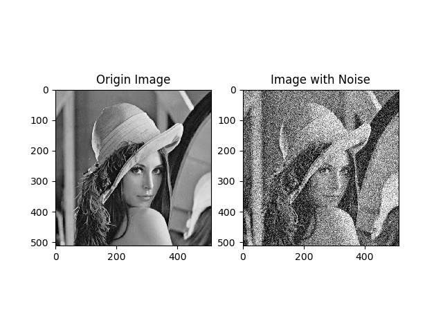
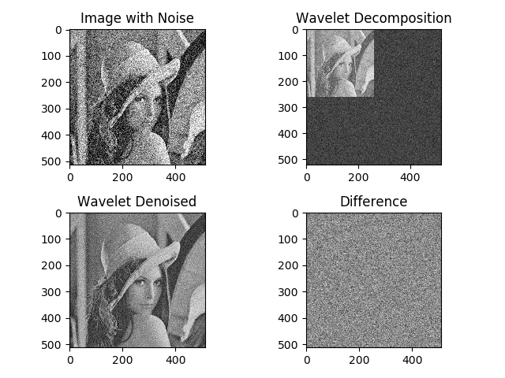
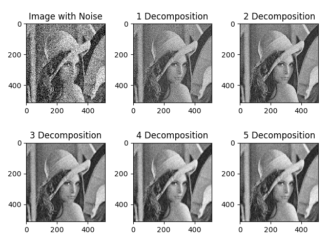

# Section 6: 小波域维纳滤波

> 实验环境
> * Python 3.6.0
> * Opencv 3.1.0
> * PyWavelets 1.1.1

## 1. 问题描述
以lena图像为例，编程实现小波域维纳滤波.

## 2. Code实现 & 实验
### 2.1 实验思路 & Code实现思路
为探究图像小波域的维纳滤波效果, 本次实验主要分为两个部分:
* 单层小波分解维纳滤波去噪实验: 探究维纳滤波去噪的有效性
* 多层小波分解的维纳滤波去噪效果对比试验: 探究多层分解滤波对去噪效果的影响

为达到上述实验目的, 需实现以下功能:
* 向图像添加高斯噪声
* 实现单层小波分解维纳滤波去噪: 
  * 小波分解(直接使用pywt.dwt2)
  * 通过斜方向边缘图像HH估计噪声方差$\sigma_n = \frac{median(abs(HH))}{0.6745}$
  * 对每个分解图像求全局方差$\sigma^2 = \frac{1}{M}\sum_i Y(i)^2 - \sigma_n^2$
  * 点运算滤波$X_i = \frac{\sigma^2}{\sigma^2 + \sigma_n^2}Y_i$
  * 小波重构(直接使用pywt.idwt2)
* 实现多层小波分解的维纳滤波去噪: 通过递归实现.

整体实验代码如下, 具体函数实现将在下面相应部分展示.
```Python
  # 读入图像
  img = cv2.imread("lena.png", 0)

  # 添加高斯噪声
  img_noise = gasuss_noise(img, var=0.4, alpha=0.25)

  plt.figure("Add Gaussian Noise")
  plt.subplot(1,2,1)
  plt.title("Origin Image")
  plt.imshow(img, "gray")
  plt.subplot(1,2,2)
  plt.title("Image with Noise")

  plt.imshow(img_noise, "gray")
  plt.savefig("img_noise.png")

  # 单层维纳滤波去噪实验
  img_de = denoise(img_noise)

  # 多层维纳滤波去噪效果对比试验
  N = 5
  plt.figure("Multi-decomposition")
  plt.subplot(2,3,1)
  plt.title("Image with Noise")
  plt.imshow(img_noise, "gray")
  for i in range(N):
      img_denoised = de(img_noise, i+1)
      plt.subplot(2,3,i+2)
      plt.title("{} Decomposition".format(i+1))
      plt.imshow(img_denoised, "gray")
  plt.tight_layout()
  plt.savefig("multi-decomposition.png")
```

下面,依次展开. 实验结果通过运行`python main.py`可获得.

### 2.2 向图像添加高斯噪声
```Python
def gasuss_noise(img, mean=0, var=0.001, alpha=0.1):
    """
    添加高斯噪声
    Parameters:
        mean : 噪声均值 
        var : 噪声方差
    """
    noise = np.random.normal(mean, var ** 0.5, img.shape)*255
    img_noise = img + alpha*noise
    img_noise = np.clip(img_noise, 0, 255.0)

    return img_noise
```
向图像添加高斯噪声的结果如下图所示.
<div align=center>
    
</div>

### 2.3 单层小波分解维纳滤波去噪实验
单层小波分解维纳滤波去噪的函数实现如下.
```Python
def denoise(img):
    """
    维纳滤波去噪
    Parameter:
        img: 含噪声图像
    Return:
        img_denoised: 维纳滤波去噪结果
    """
    # 小波分解
    A, (H, V, D) = pywt.dwt2(img, 'bior4.4')

    # 排版: 以便后续可视化小波分解结果
    AH = np.concatenate([A, H], axis=1)
    VD = np.concatenate([V, D], axis=1)
    fig = np.concatenate([AH, VD], axis=0)

    # 维纳滤波
    sigma_n = np.median(np.abs(D))/0.6745
   
    AHVD = []
    for i in [H, V, D]:
        sigma_sq = np.mean(i**2) - sigma_n**2
        i = (sigma_sq/(sigma_sq + sigma_n**2)) * i
        AHVD.append(i)
    [H, V, D] = AHVD
    
    # 小波重构
    img_denoised = pywt.idwt2((A,(H,V,D)), 'bior4.4')
    


    # 比较滤波前后差异
    img_diff = img -img_denoised

    # 可视化结果
    plt.figure("Wavelet Denoising")
    plt.subplot(2,2,1)
    plt.title("Image with Noise")
    plt.imshow(img, "gray")
    plt.subplot(2,2,2)
    plt.title("Wavelet Decomposition")
    plt.imshow(fig, "gray")
    plt.subplot(2,2,3)
    plt.title("Wavelet Denoised")
    plt.imshow(img_denoised, "gray")
    plt.subplot(2,2,4)
    plt.title("Difference")
    plt.imshow(img_diff, "gray")
    plt.tight_layout()
    plt.savefig("img_denoised.png")

    return img_denoised
```

单层小波分解的维纳滤波去噪结果如下图所示.
<div align=center>
    
</div>
可以看到, 通过小波分解, 基于斜方向边缘图像计算的噪声方差能较好地估计真实的噪声方差, 经维纳滤波后, 大部分噪声被成功滤去, 去噪效果较好.

### 2.4 多层小波分解的维纳滤波去噪效果对比试验
递归实现的多层小波分解维纳滤波去噪函数如下.
```Python
def de(img, n, sigma_n=None):
    """
    维纳滤波去噪: 递归多层分解去噪
    Parameters:
        img: 待分解去噪图像
        n: 待分解层数
        sigma_n: 噪声方差(由第一层分解的HH计算得到)
    Return:
        img_denoised: 维纳滤波去噪结果
    """
    # 递归终止条件: 待分解层数为0
    if not(n): return img

    # 递归多层维纳滤波
    # 小波分解
    A, (H, V, D) = pywt.dwt2(img, 'bior4.4')
    # 对于第一层分解, 计算噪声方差
    if not(sigma_n): sigma_n = np.median(np.abs(D))/0.6745
    # 递归
    A = de(A, n-1, sigma_n)
    # 递归异常处理: 处理pywt对奇数行列图像分解重构后行列数增加1的特殊情况
    if A.shape[0] > H.shape[0]: A = A[:-1, :-1]
    # 维纳滤波
    AHVD = []
    for i in [H, V, D]:
        sigma_sq = np.mean(i**2) - sigma_n**2
        i = (sigma_sq/(sigma_sq + sigma_n**2)) * i
        AHVD.append(i)
    [H, V, D] = AHVD
    # 小波重构
    img_denoised = pywt.idwt2((A,(H,V,D)), 'bior4.4')

    return img_denoised
```
实验时, 依次对噪声图片进行了1层至5层的小波分解滤波去噪, 其各自的去噪效果如下图所示.
<div align=center>
       
</div>
可以看到, 随着分解层数的增多, 去噪效果有所提升, 但同时, 图像也无法避免地变得模糊. 另外, 也可以发现, 虽然层数越多去噪效果越好, 但越往后去噪效果的差异越小. 