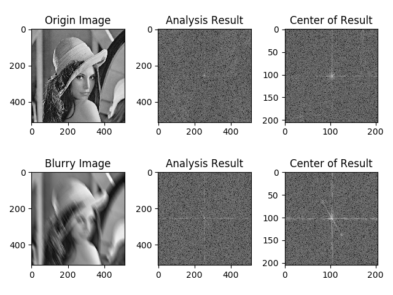
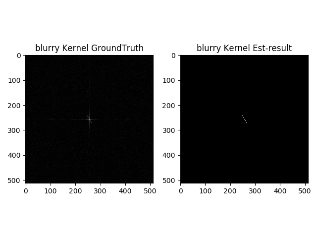
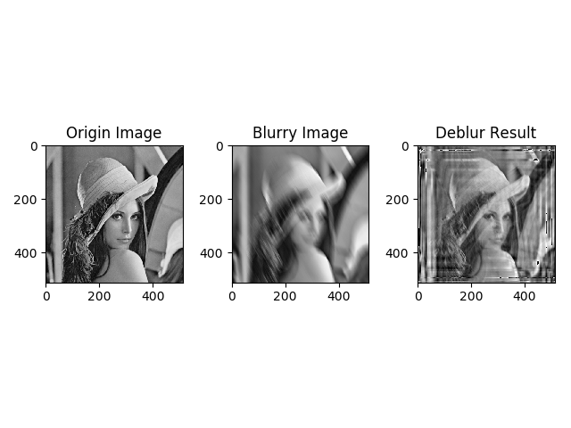
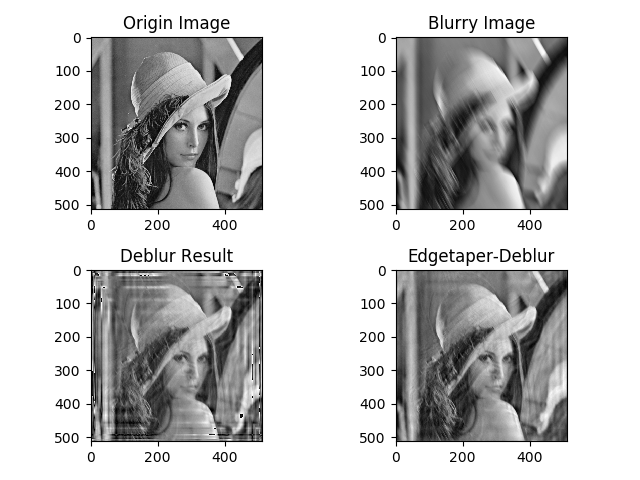

# Section 7: 图像复原与重建

> 实验环境
> * Python 3.6.0
> * Opencv 3.1.0

## 问题描述
综合利用图像处理课程中学习到的相关知识，去除测试图片test.png中的模糊，获得一张清晰的图像.

## Code实现 & 实验
### 1. 实验思路 & Code实现思路
为实现对测试图片的去模糊, 需实现以下两个子功能:
* 图像的模糊核估计: 根据可参数化的模糊核估计方法, 对图像进行$DFT{log|DFT(u,v)|}$操作, 可视化结果, 估计模糊核, 根据估计重建模糊核.
* 图像去模糊: 利用重建的模糊核, 基于维纳滤波实现图像的去模糊.

整体实验代码如下, 具体函数实现将在下面相应部分展示.
```Python
    # 读入图像
    img = cv2.imread("./lena.png", 0)
    img_blur = cv2.imread("./test.png", 0)
    # 可参数化模糊核估计 & 可视化
    blurry_analysis(img, img_blur)
    # 模糊核重建 & 对比
    blurry_k = kernel_est(img_blur.shape, -30, 42)

    blurry_k_gt = get_blurry_k_gt(img,  img_blur)

    plt.subplot(1,2,1)
    plt.title("blurry Kernel GroundTruth")
    plt.imshow(blurry_k_gt, cmap='gray')
    plt.subplot(1,2,2)
    plt.title("blurry Kernel Est-result")
    plt.imshow(blurry_k, cmap='gray')
    plt.tight_layout()
    plt.savefig("blurry_kernel.png")

    

    # 维纳滤波去模糊
    img_result = wiener(img_blur, blurry_k)


    plt.subplot(1,3,1)
    plt.title("Origin Image")
    plt.imshow(img, cmap='gray')
    plt.subplot(1,3,2)
    plt.title("Blurry Image")
    plt.imshow(img_blur, cmap='gray')
    plt.subplot(1,3,3)
    plt.title("Deblur Result")
    plt.imshow(img_result, cmap='gray')
    plt.tight_layout()
    plt.savefig("result.png")

    # Edgetaper 去振铃效果对比
    img_et = cv2.imread("./lena_edgetaper.png", 0)
    img_et_result = wiener(img_et, blurry_k)

    plt.subplot(2,2,1)
    plt.title("Origin Image")
    plt.imshow(img, cmap='gray')
    plt.subplot(2,2,2)
    plt.title("Blurry Image")
    plt.imshow(img_blur, cmap='gray')
    plt.subplot(2,2,3)
    plt.title("Deblur Result")
    plt.imshow(img_result, cmap='gray')
    plt.subplot(2,2,4)
    plt.title("Edgetaper-Deblur")
    plt.imshow(img_et_result, cmap='gray')
    plt.tight_layout()
    plt.savefig("result_et.png")
```

### 2. 图像的模糊核估计实验
首先, 对图像的模糊核进行估计与可视化. 实现代码如下.
```Python
  def blurry_analysis(img_origin, img_blur):
      """
      可参数化的模糊核估计 & 可视化对比
      Parameter:
          img_origin: Origin image
          img_blur: Blurry image
      """
      # 模糊核估计
      img_b_fft = np.fft.fft2(np.log(np.fft.fft2(img_blur)))
      img_b_fft = np.fft.fftshift(img_b_fft)
      img_b_fft = 20*np.log(np.abs(img_b_fft))
      # 对原图做相同操作, 用以对比
      img_o_fft = np.fft.fft2(np.log(np.fft.fft2(img_origin)))
      img_o_fft = np.fft.fftshift(img_o_fft)
      img_o_fft = 20*np.log(np.abs(img_o_fft))
      # 取中间部分图像, 便于可视化观察
      h, w = img_o_fft.shape[:2]
      img_o_center = img_o_fft[int(3*h/10):int(7*h/10)
                                , int(3*w/10):int(7*w/10)]


      img_b_center = img_b_fft[int(3*h/10):int(7*h/10)
                                , int(3*w/10):int(7*w/10)]
      # 可视化
      plt.subplot(2,3,1)
      plt.title("Origin Image")
      plt.imshow(img_origin, cmap='gray')
      plt.subplot(2,3,2)
      plt.title("Analysis Result")
      plt.imshow(img_o_fft, cmap='gray')
      plt.subplot(2,3,3)
      plt.title("Center of Result")
      plt.imshow(img_o_center, cmap='gray')
      plt.subplot(2,3,4)
      plt.title("Blurry Image")
      plt.imshow(img_blur, cmap='gray')
      plt.subplot(2,3,5)
      plt.title("Analysis Result")
      plt.imshow(img_b_fft, cmap='gray')
      plt.subplot(2,3,6)
      plt.title("Center of Result")
      plt.imshow(img_b_center, cmap='gray')
      plt.tight_layout()
      plt.savefig("analysis.png")
```
可视化结果如下图所示.

从可视化结果可以发现, 测试图片的模糊属于运动模糊, 并可以大致估计出模糊核的角度为与竖直夹角-30°, 长度约为40, 进而可以重建运动模糊核.

```Python


  def kernel_est(img_shape, theta, length):
      """
      运动模糊核重建
      Parameter:
          img_shape: 图像尺寸[h,w]
          theta: 运动模糊核角度
          length: 运动模糊核长度
      Return:
          kernel: 重建的运动模糊核
      """
      # 参数初始化
      h, w = img_shape[:2]
      pos_c_h = round(h/2)
      pos_c_w = round(w/2)
      theta = np.pi * (-theta/180)
      # 重建运动模糊核
      kernel = np.zeros((h, w))
      for i in range(length):
          l = length/2 - i
          delta_w = l * np.cos(theta)
          delta_h = l * np.sin(theta)
          kernel[int(pos_c_w+delta_w), int(pos_c_h+delta_h)] = 1
      kernel = kernel/np.sum(kernel)

      return kernel
```
实验为检验估计并重建的运动模糊核的正确性, 利用清晰原图生成模糊核的真实值, 可视化进行对比.

```Python
  def get_blurry_k_gt(img_origin, img_blur):
      """
      获取真实的模糊核
      Parameter:

      """
      img_o_fft = np.fft.fft2(img_origin)
      img_b_fft = np.fft.fft2(img_blur)
      blurry_fft = np.fft.ifft2(img_b_fft / img_o_fft)
      blurry_fft = np.abs(np.fft.fftshift(blurry_fft))
      blurry_fft = blurry_fft/ np.sum(blurry_fft)

      return blurry_fft
```
运动模糊核真实值的可视化结果 与 重建的模糊核 的对比结果如下图所示.

可以看出, 运动模糊核的重建效果较好.

### 3. 图像去模糊实验
利用之前估计并重建的模糊核, 基于维纳滤波实现去模糊.

```Python
  def wiener(img_blur, kernel, K=0.005):
      """
      维纳滤波
      Parameter:
          img_blur: 模糊图像
          kernel: 模糊核
          K: 分母参数
      Return:
          img_result: 维纳滤波去模糊结果
      """
      img_b_fft = np.fft.fft2(img_blur)
      kernel_fft = np.fft.fft2(kernel)
      kernel_fft = np.conj(kernel_fft) / (np.abs(kernel_fft)**2 + K)
      img_result = np.fft.ifft2(img_b_fft * kernel_fft)
      img_result = np.abs(np.fft.fftshift(img_result))
      img_result = img_result.astype(np.uint8)

      return img_result
```
测试图像去模糊的结果如下, 为更好的对比去模糊效果, 下图中左图为原始清晰图像, 中间为测试模糊图像, 右图为去模糊结果图像.



可见上述算法具有一定的去模糊效果, 但同时图像存在明显的振铃现象. 振铃现象可通过Edgetaper算法改善. 由于Python OpenCV中没有相关的函数,
因此, 在MATLAB中调用Edgetaper函数预处理模糊图像, 以其为基础, 进行维纳滤波去模糊. 其结果如下图所示.



对比第二行两张图, 可以明显看出, Edgetaper算法可以有效去振铃, 经其预处理后的图像再利用维纳滤波去模糊可以得到较好的结果, 如图中右下方图所示.
另外, 对比右侧一列的去模糊前后图, 可以发现实验中实现的代码可以有效的改善运动模糊, 效果较为明显. 对比左上原图和右下去模糊结果图, 可以发现, 
虽然算法可以有效改善模糊状况, 但去模糊后的结果和原始清晰图像间仍存在一定的差距.